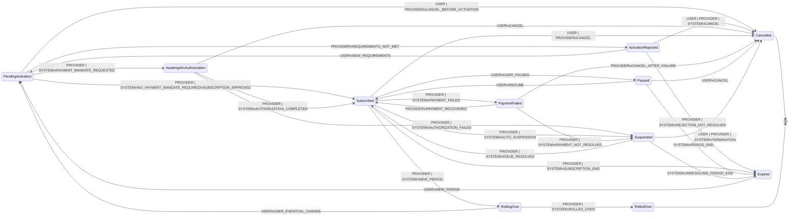

```mermaid 
stateDiagram-v2
direction LR

    %% Core lifecycle
    PendingActivation --> ActivationRejected : PROVIDER\nREQUIREMENTS_NOT_MET
    PendingActivation --> AwaitingAhcAuthorization : PROVIDER | SYSTEM\nPAYMENT_MANDATE_REQUESTED
    PendingActivation --> Subscribed : PROVIDER | SYSTEM\nNO_PAYMENT_MANDATE_REQUIRED\nSUBSCRIPTION_APPROVED
    PendingActivation --> Cancelled : USER | PROVIDER\nCANCEL_BEFORE_ACTIVATION

    ActivationRejected --> PendingActivation : USER\nNEW_REQUIREMENTS
    ActivationRejected --> Expired : PROVIDER | SYSTEM\nREJECTION_NOT_RESOLVED
    ActivationRejected --> Cancelled : USER | PROVIDER | SYSTEM\nCANCEL

    AwaitingAhcAuthorization --> Subscribed : PROVIDER | SYSTEM\nAUTHORIZATION_COMPLETED
    AwaitingAhcAuthorization --> Suspended : PROVIDER | SYSTEM\nAUTHORIZATION_FAILED
    AwaitingAhcAuthorization --> Cancelled : USER\nCANCEL

    %% Active subscription
    Subscribed --> RollingOver : PROVIDER | SYSTEM\nNEW_PERIOD
    Subscribed --> Paused : USER\nUSER_PAUSED
    Subscribed --> PaymentFailed : PROVIDER | SYSTEM\nPAYMENT_FAILED
    Subscribed --> Suspended : PROVIDER | SYSTEM\nAUTO_SUSPENSION
    Subscribed --> Expired : PROVIDER | SYSTEM\nSUBSCRIPTION_END
    Subscribed --> Cancelled : USER | PROVIDER\nCANCEL

    %% Payment issues
    PaymentFailed --> Subscribed : PROVIDER\nPAYMENT_RECOVERED
    PaymentFailed --> Suspended : PROVIDER | SYSTEM\nPAYMENT_NOT_RESOLVED
    PaymentFailed --> Cancelled : PROVIDER\nCANCEL_AFTER_FAILURE

    %% Pausing
    Paused --> Subscribed : USER\nRESUME
    Paused --> Expired : SYSTEM\nPERIOD_END
    Paused --> Cancelled : USER\nCANCEL

    %% Suspension
    Suspended --> Subscribed : PROVIDER | SYSTEM\nISSUE_RESOLVED
    Suspended --> Expired : SYSTEM\nUNRESOLVED_PERIOD_END
    Suspended --> Cancelled : USER | PROVIDER | SYSTEM\nTERMINATION

    %% Renewal
    Expired --> PendingActivation : USER\nNEW_PERIOD

    %% Rollover handling
    RollingOver --> PendingActivation : USER\nUSER_EVENTUAL_CHANGE
    RollingOver --> RolledOver : PROVIDER | SYSTEM\nROLLED_OVER

    %% Terminal states
    Cancelled --> [*]
    RolledOver --> [*]
```

```mermaid

stateDiagram-v2

direction LR

    %% Core lifecycle
    PendingActivation --> ActivationRejected : PROVIDER\nREQUIREMENTS_NOT_MET
    PendingActivation --> AwaitingAhcAuthorization : PROVIDER | SYSTEM\nPAYMENT_MANDATE_REQUESTED
    PendingActivation --> Subscribed : PROVIDER | SYSTEM\nNO_PAYMENT_MANDATE_REQUIRED\nSUBSCRIPTION_APPROVED
    PendingActivation --> Cancelled : USER | PROVIDER\nCANCEL_BEFORE_ACTIVATION

    ActivationRejected --> PendingActivation : USER\nNEW_REQUIREMENTS
    ActivationRejected --> Expired : PROVIDER | SYSTEM\nREJECTION_NOT_RESOLVED
    ActivationRejected --> Cancelled : USER | PROVIDER | SYSTEM\nCANCEL

    AwaitingAhcAuthorization --> Subscribed : PROVIDER | SYSTEM\nAUTHORIZATION_COMPLETED
    AwaitingAhcAuthorization --> Suspended : PROVIDER | SYSTEM\nAUTHORIZATION_FAILED
    AwaitingAhcAuthorization --> Cancelled : USER\nCANCEL

    %% Active subscription
    Subscribed --> RollingOver : PROVIDER | SYSTEM\nNEW_PERIOD
    Subscribed --> Paused : USER\nUSER_PAUSED
    Subscribed --> PaymentFailed : PROVIDER | SYSTEM\nPAYMENT_FAILED
    Subscribed --> Suspended : PROVIDER | SYSTEM\nAUTO_SUSPENSION
    Subscribed --> Expired : PROVIDER | SYSTEM\nSUBSCRIPTION_END
    Subscribed --> Cancelled : USER | PROVIDER\nCANCEL

    %% Payment issues
    PaymentFailed --> Subscribed : PROVIDER\nPAYMENT_RECOVERED
    PaymentFailed --> Suspended : PROVIDER | SYSTEM\nPAYMENT_NOT_RESOLVED
    PaymentFailed --> Cancelled : PROVIDER\nCANCEL_AFTER_FAILURE

    %% Pausing
    Paused --> Subscribed : USER\nRESUME
    Paused --> Expired : SYSTEM\nPERIOD_END
    Paused --> Cancelled : USER\nCANCEL

    %% Suspension
    Suspended --> Subscribed : PROVIDER | SYSTEM\nISSUE_RESOLVED
    Suspended --> Expired : SYSTEM\nUNRESOLVED_PERIOD_END
    Suspended --> Cancelled : USER | PROVIDER | SYSTEM\nTERMINATION

    %% Renewal
    Expired --> PendingActivation : USER\nNEW_PERIOD

    %% Rollover handling
    RollingOver --> PendingActivation : USER\nUSER_EVENTUAL_CHANGE
    RollingOver --> RolledOver : PROVIDER | SYSTEM\nROLLED_OVER

    %% Terminal states
    Cancelled --> [*]
    RolledOver --> [*]
```